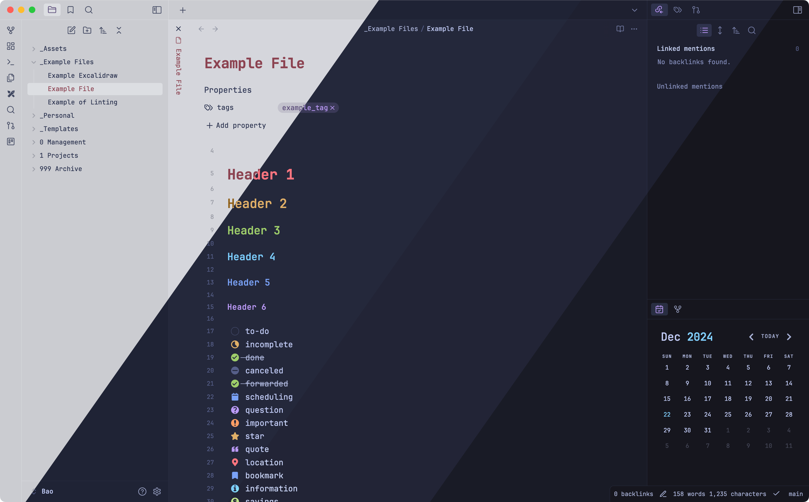
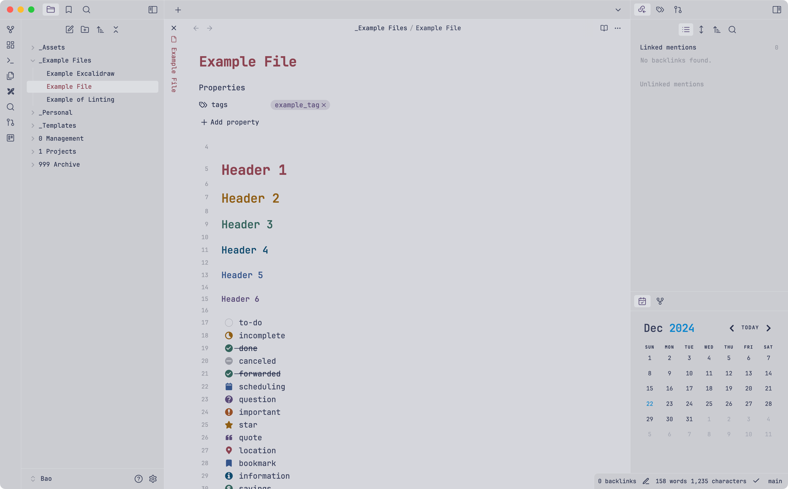
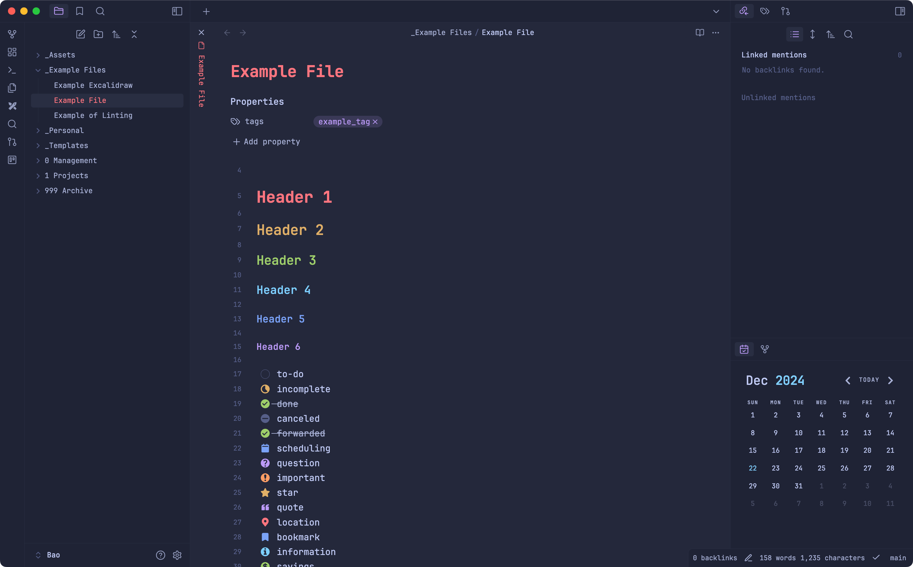
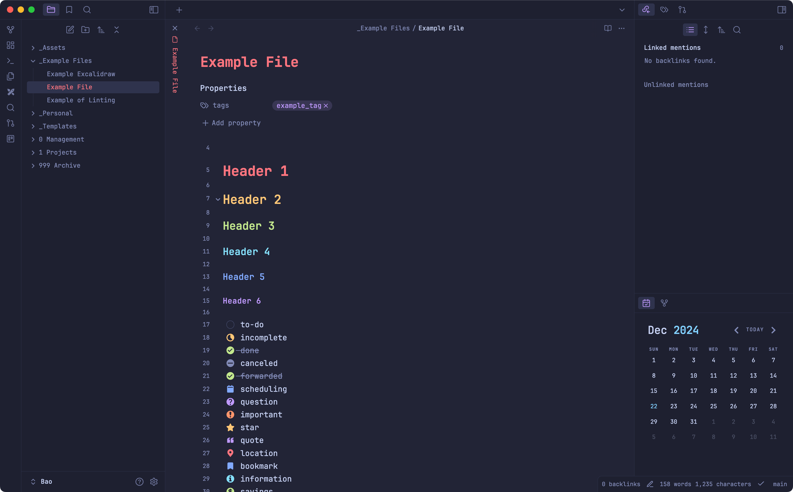
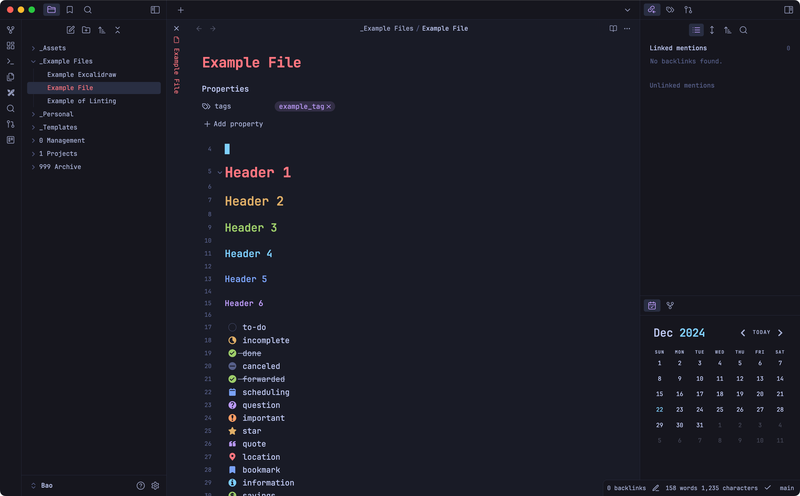
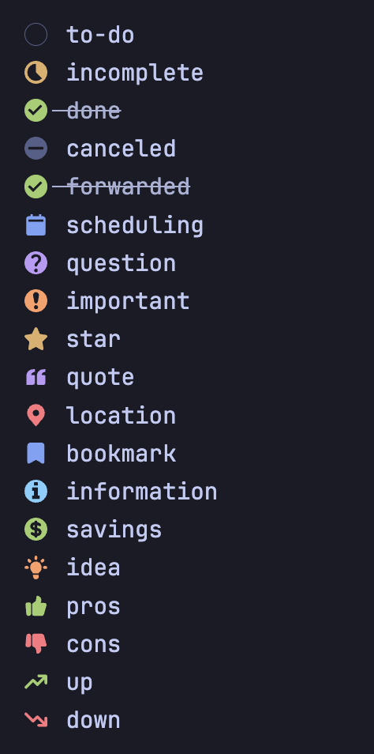

# Obsidian and Tokyonight

A tokyonight theme for [Obsidian](https://obsidian.md). Colors from [tokyonight.nvim](https://github.com/folke/tokyonight.nvim) and [VSCode Tokyonight](https://github.com/enkia/tokyo-night-vscode-theme). To change colors please install [Style Settings](https://github.com/mgmeyers/obsidian-style-settings)



# Versions

Import the styles into Style Settings for Storm and Moon. Both the Night and Light themes are the default.

## Light



## Storm

[Storm Style Settings Configuration](./variants/tokyonight-storm.json)



## Moon

[Moon Style Setting Configuration](./variants/tokyonight-moon.json)



## Night



# Checkbox Styling 



```
- [ ] to-do
- [/] incomplete
- [x] done
- [-] canceled
- [x] forwarded
- [<] scheduling
- [?] question
- [!] important
- [*] star
- ["] quote
- [l] location
- [b] bookmark
- [i] information
- [S] savings
- [I] idea
- [p] pros
- [c] cons
- [u] up
- [d] down
```

## Credit 

- [tokyonight.nvim](https://github.com/folke/tokyonight.nvim) and [VSCode Tokyonight](https://github.com/enkia/tokyo-night-vscode-theme) for the wonderful theme colors.
- [Obsidian Border](https://github.com/Akifyss/obsidian-border/tree/main) for some amazing styles. 

